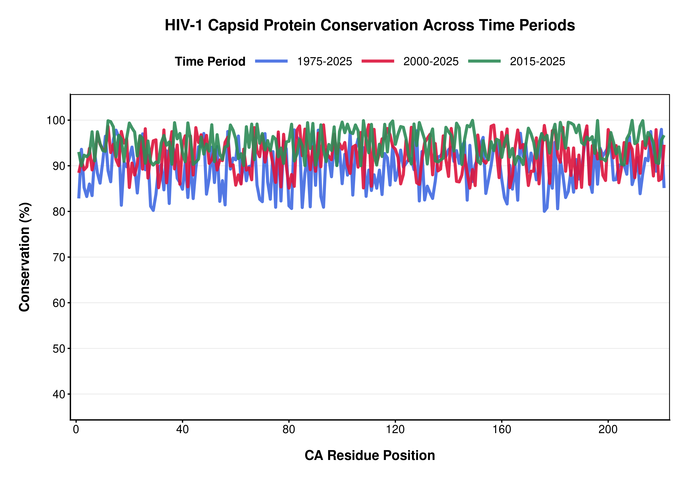
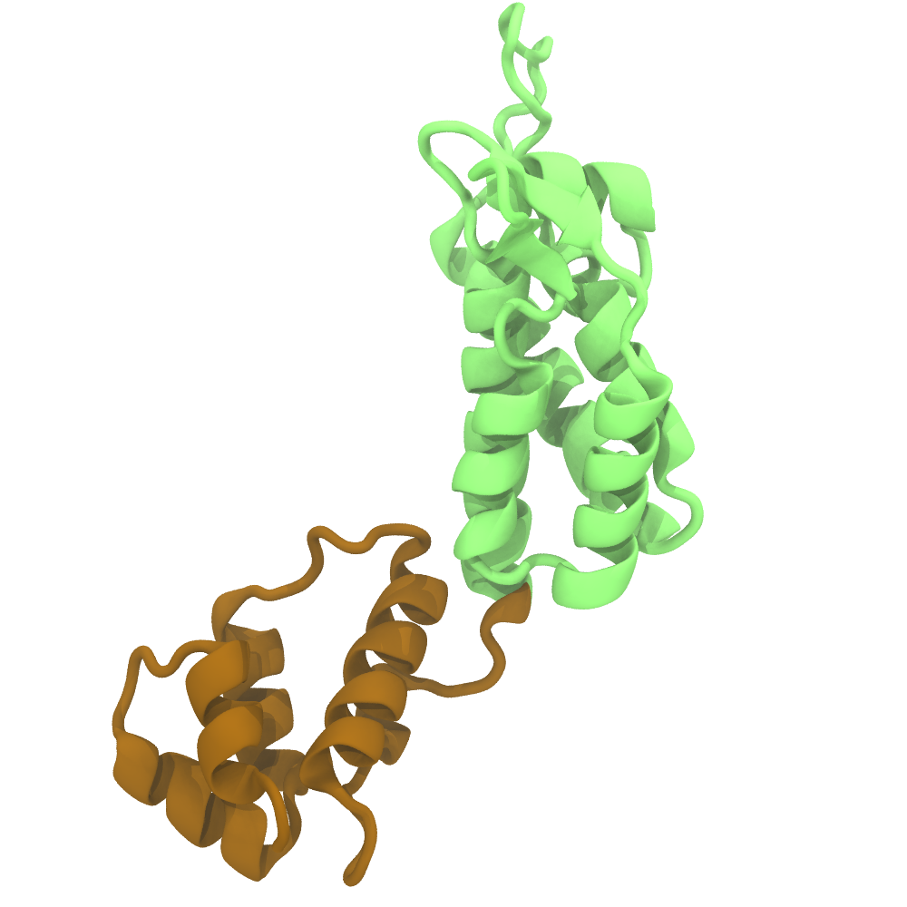
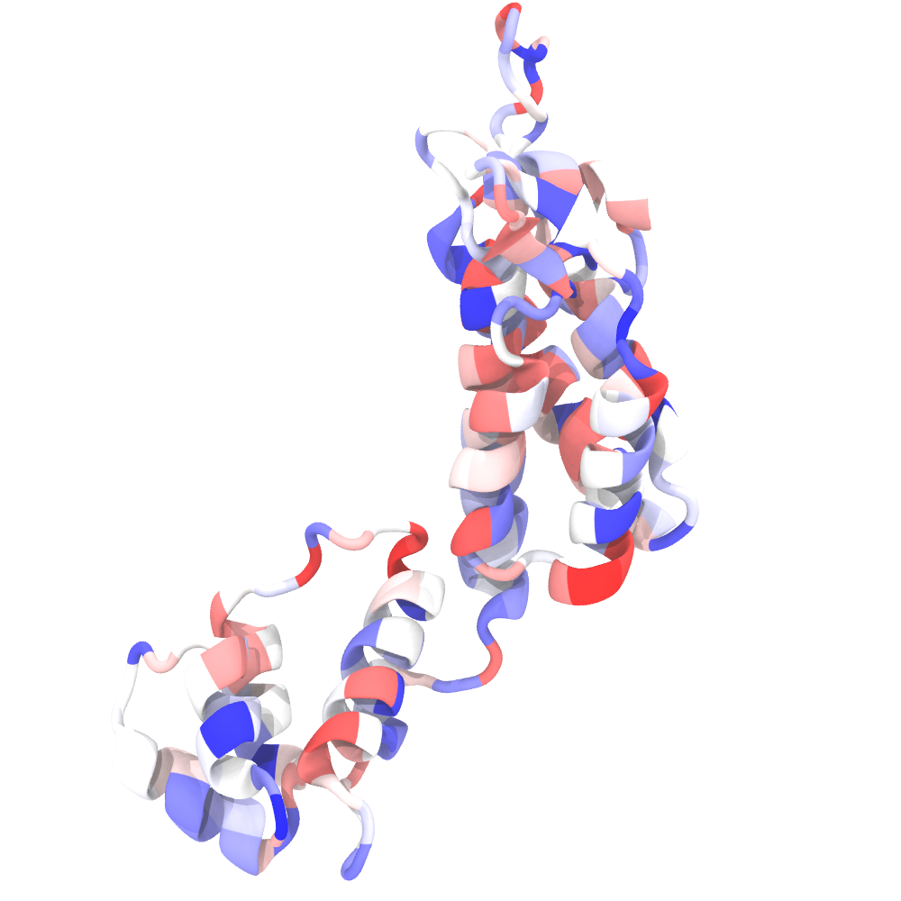
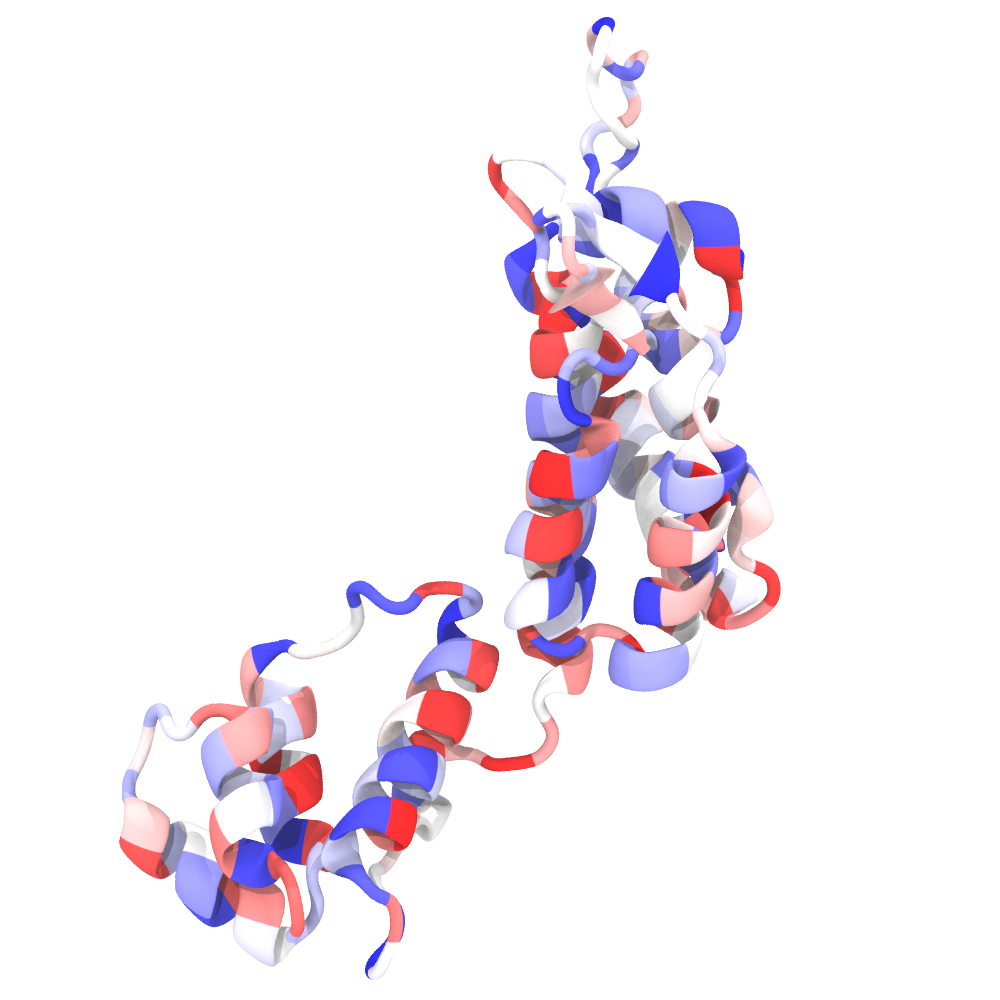
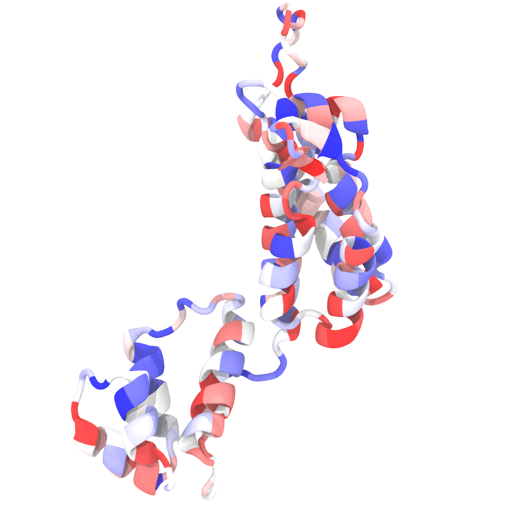
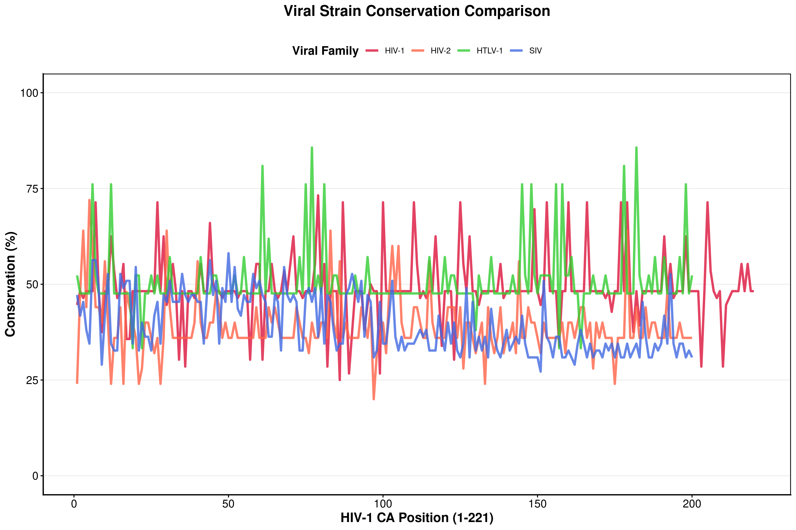

# HIV-1 Capsid Protein Conservation Analysis

## Introduction

The assembly of HIV-1 capsid protein (CA) is an essential component of the HIV-1 maturation process. CA exists as a monomeric protein that reorganizes during maturation, and reorients into higher order oligomers, forming hexameric and pentameric units. Subsequently, these larger units of CA protein self-assemble into a conical envelope that envelopes the viral genome. The mature capsid functions as a protective barrier that shields the genome against immune defense before releasing its retroviral genome into its host cell (Pornillos et al. 2011; Mattei et al. 2016; Pornillos et al. 2009). Previous studies have attempted to elucidate mechanisms of CA maturation (Pornillos et al. 2007), but the precise physical and biochemical interactions that stabilize the maturation process remain unclear.

As a result, significant effort has focused on identifying small molecules that modulate capsid assembly and maturation, including maturation inhibitors like bevirimat and lenacapavir (Pak et al. 2021; Segal-Maurer et al. 2022) as well as cofactors such as inositol hexakisphosphate (IP6), which stabilizes capsid assembly and promotes proper lattice flexibility and formation (Garza et al. 2025). These molecules provide important insight into the determinants governing capsid stability and maturation. Because the HIV-1 capsid is a highly cooperative lattice of hexamers and pentamers, any structural perturbations propagate through networks of bonded and nonbonded interactions across the capsid. Such small molecule binding events may have a significant effect on the stability and certain properties of the capsid lattice.

Understanding how such perturbations influence capsid structure is tied to the fundamentals of protein structure and function. The balance between sequence and three-dimensional structure while still permitting evolution underlies many biological processes (Guo et al. 2004). This principle allows proteins, such as the HIV-1 capsid protein, to evolve and acquire functional complexity, while remaining sensitive to mutations that can alter stability. By revealing interactions in the HIV-1 mature capsid lattice, this study hopes to provide insights highlighting evolutionary constraints while preserving function.

To study the HIV-1 capsid protein in an evolutionary context, we can acquire protein sequence data from online databases. These large datasets enable comparison across lineages to allow for comparisons across time and lineages. Multiple sequence alignments (MSAs) can align and quantify amino acid sequence conservation and variability among HIV-1 capsid protein sequences. Additionally, these sequences can be mapped onto three-dimensional structural information to relate evolutionary conservation to capsid structure and function, possibly revealing crucial residues at intermolecular interfaces that contribute to maintaining stability of the fullerene cone. This evolutionary framework also enables identification of allosteric networks — long-range interactions that local perturbations like the binding of small molecules can propagate throughout the lattice and influence certain characteristics of the mature capsid. Together, these analyses identify which regions of HIV-1 capsid protein are under strong evolutionary constraint, corresponding to essential, functional amino acid residues.

## Results

### Temporal evolution of HIV-1 capsid conservation shows minimal variation

To first assess evolutionary pressures that have affected HIV-1 capsid protein (CA) over time, we conducted a multiple sequence alignment (MSA) to determine which amino acids are positioned across lineages. The temporal datasets of CA protein across HIV-1 were collected from patient data from the years 1975–2025, 2000–2015, and 2015–2025. This alignment and subsequent calculations revealed a high degree of conservation across the CA sequence, with most portions maintaining consistency.

Across the three time periods, the full historical dataset (1975–2025) of HIV-1 CA exhibits the greatest variability compared to more recent datasets (Fig. 1). In contrast, more recent datasets (2000–2025) indicate higher overall convergence, likely owing to modern CA sequence being referenced. The intermediate dataset follows a transitional pattern between the two datasets.

Despite overall high conservation, the conservation metrics illustrate very localized fluctuations in sequence, with sharp drops at certain residue positions. These erratic features are consistent among the time periods, indicating that certain regions of CA are more prone to mutation. The persistence of these variable sites suggests structurally and functionally flexible regions within the protein.

Mapping conservation scores onto the three-dimensional structure of CA provides structural context for these patterns. Structurally ordered regions, particularly alpha-helical segments, exhibit higher conservation, consistent with their functional role in capsid assembly. In contrast, loop regions and disordered linkers display variability, indicating less essential amino acids with reduced stability context. Together, these results emphasize the difference between sequence information and structural data within the CA protein.

Original CA protein structure: 

The colored conservation scores for 1975-2025:

2000-2025:

2015-2025:

### Viral strain comparisons in related retroviral capsid proteins indicates distantly related sequence evolution

To further place capsid conservation in a broader evolutionary context, similar conservation profiles were compared across related retroviral families, including HIV-2, SIV, and HTLV-1 (Fig. 2). Amino acid sequences of each viral capsid protein were aligned with the reference HIV-1 CA protein sequence, enabling comparisons across homologous residues.

Across viral families, HIV-1 exhibits the highest conservation across the CA sequence, with most residues hovering around ~45–60% conservation. In contrast, HTLV-1, HIV-2, and SIV display higher variability with around ~30–45% conservation, with distinct spikes in conservation suggesting localized structural constraints, similar to the temporal data shown in Fig. 1. Conservation is not uniformly distributed; instead, certain regions have elevated conservation, suggesting functionally constrained sites. This pattern suggests that capsid evolution between lineages and strains is not uniform, but reflects a balance between functional regions of the protein and flexible regions that are able to evolutionarily diverge.

## Discussion

This study combines temporal and cross-strain protein sequence analyses to characterize evolutionary constraints. Across both analyses, the conservation metric suggests capsid proteins are overall highly conserved, with regions of localized variability. This suggests capsid evolution is driven by strong structural and functional constraints that preserve the integrity of the protein, while permitting minimal variation in specific regions.

Here we show conservation is not uniformly distributed along the CA sequence. Instead, distinct positions exhibit either sharp increases or reductions in conservation that can be seen across temporal windows. The similar pattern suggests evolutionary pressures and mutations are not random, but correspond to regions of the protein that can tolerate mutation without losing function. This study is significant as highly conserved regions likely correspond to structurally critical sites and represent potential targets for antiviral drug development.

## Methods

### Data collection and sequence alignment

The HIV-1 amino acid sequences were acquired from the Los Alamos HIV Database web server (https://www.hiv.lanl.gov/content/sequence/HIV/mainpage.html). Sequences were prefiltered using the database tools to select sequence sets from 1975–2025, 2000–2025, and 2015–2025 of subtype B of the Gag protein. To minimize statistical artifacts, only one sequence per patient was acquired.

Because capsid self-assembly is a crucial process involving only the CA domain (residues 1–221) of the Gag protein, sequences were restricted to the CA region. A reference CA sequence was used to define residue boundaries, and corresponding positions were extracted from the database's full-length Gag protein.

Multiple sequence alignments (MSAs) were generated for each dataset using MAFFT (Katoh et al. 2002) with default parameters. The resulting alignments were processed in R for analysis and plotting.

### Conservation score calculation

The conservation metric was calculated by aligning the sequences and counting the frequency a certain amino acid appears at a location. For each alignment position *i*, amino acid frequencies were calculated as:

$$f_i(a) = \frac{n_i(a)}{N_i}$$

where $n_i(a)$ is the number of occurrences of amino acid $a$ and $N_i$ is the total number of appearing residues at that position. Gap residues were excluded from calculations. A conservation score was defined as the relative frequency of the most abundant amino acid at each position:

$$C_i = \max_a f_i(a)$$

where $C_i$ ranges from 0 to 1, with values close to 1 indicating strong functional conservation.

All analyses were performed using custom R scripts and conservation scores were visualized using the ggplot2 package.

### Mapping conservation scores onto three-dimensional structures

To relate sequence conservation to structural context, conservation scores were mapped onto the three-dimensional structure of CA. The amino acid sequence of a monomer derived from the protein structure (PDB ID: 6BHT) was used as a reference, and per-residue conservation scores $C_i$ were assigned to the corresponding residues in the structure. Scores were written into the Beta factor column of modified PDB files and loaded into VMD (Humphrey et al. 1996), where a continuous color scale was applied. Highly conserved residues were colored in blue and more variable residues colored in red. This approach enables better comparison of conserved residues to identification of conserved interfaces, such as domain interfaces and oligomerization contacts.

### Multi-viral capsid comparison strategies between protein sequences

To enable cross-family comparison, capsid (CA) regions were extracted from full-length Gag sequences using approximate positional boundaries. Additional viral capsid and nucleocapsid protein sequences were retrieved from the NCBI Protein database using the Entrez E-utilities API. Sequence retrieval was performed programmatically using bash scripts that issued HTTP requests via `curl` to the `efetch` endpoints. Search results were parsed using `jq` to obtain WebEnv and query keys, enabling batch retrieval of FASTA-formatted sequences.

Queries were constructed using organism and protein-specific terms (e.g., "HIV-2 and gag", "SARS-CoV-2 and nucleocapsid"), and up to 50 sequences were retrieved per viral family. Retrieved sequences were stored in FASTA format for downstream analysis. For HIV-1 sequences, the CA domain was defined based on established residue boundaries within Gag, corresponding approximately to positions 130–350. A fixed-length sequence (~220 residues) was extracted from each sequence, ensuring direct comparison to HIV-1 CA protein. For other retroviral families (HIV-2, SIV, HTLV-1), CA-like regions were approximated using analogous positional windows (typically ~120–320 in Gag), reflecting homologous regions. Gap residues among the viral strains were omitted to align protein sequence.

## References

Ganser-Pornillos BK, Cheng A, Yeager M. 2007. Structure of full-length HIV-1 CA: a model for the mature capsid lattice. *Cell* **131:** 70–79.

Garza CM, Holcomb M, Santos-Martins D, Torbett BE, Forli S. 2025. IP6, PF74 affect HIV-1 capsid stability through modulation of hexamer-hexamer tilt angle preference. *Biophys J* **124:** (in press; doi: 10.1016/j.bpj.2024.11.019).

Guo HH, Choe J, Loeb LA. 2004. Protein tolerance to random amino acid change. *Proc Natl Acad Sci USA* **101:** 9205–9210.

Humphrey W, Dalke A, Schulten K. 1996. VMD: visual molecular dynamics. *J Mol Graph* **14:** 33–38.

Katoh K, Misawa K, Kuma K, Miyata T. 2002. MAFFT: a novel method for rapid multiple sequence alignment based on fast Fourier transform. *Nucleic Acids Res* **30:** 3059–3066.

Mattei S, Anders M, Bharat TAM, Briggs JAG, Kühlbrandt W. 2016. The structure and flexibility of conical HIV-1 capsids determined within intact virions. *Science* **354:** 1434–1437.

Pak AJ, Purdy MD, Yeager M, Voth GA. 2021. Preservation of HIV-1 Gag helical bundle symmetry by Bevirimat is central to maturation inhibition. *J Am Chem Soc* **143:** 19137–19148.

Pornillos O, Ganser-Pornillos BK, Kelly BN, Hua Y, Whitby FG, Stout CD, Sundquist WI, Hill CP, Yeager M. 2009. X-ray structures of the hexameric building block of the HIV capsid. *Cell* **137:** 1282–1292.

Pornillos O, Ganser-Pornillos BK, Yeager M. 2011. Atomic-level modelling of the HIV capsid. *Nature* **469:** 424–427.

Segal-Maurer S, DeJesus E, Stellbrink H-J, Castagna A, Richmond GJ, Sinclair GI, Siripassorn K, Ruane PJ, Berhe M, Wang H, et al. 2022. Capsid inhibition with lenacapavir in multidrug-resistant HIV-1 infection. *N Engl J Med* **386:** 1793–1803.
